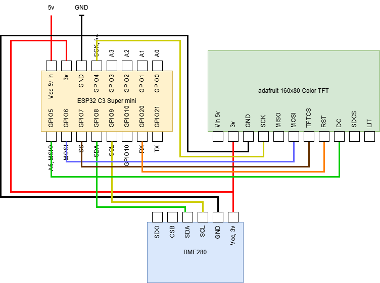

# ESP32-C3 Modular Sensor Monitor

A highly modular ESP32-C3 based sensor monitoring system with real-time graphical display. This project demonstrates a clean architecture for integrating multiple sensor types (I2C, UART, GPIO/Analog) with a unified display interface, using a registry pattern for easy extensibility.

## 📋 Hardware Components

- **ESP32-C3 SuperMini** - Ultra-compact ESP32-C3 development board
- **ST7735 160x80 TFT Display** - Color LCD for real-time data visualization
- **BME280 Sensor** - Environmental sensor (temperature, humidity, pressure)
- Additional sensor support: LD2420 (UART radar), C4001 (I2C CO2), QYF0900 (Analog light)

## ✨ Features

- 🔌 **Modular Sensor Framework** - Plugin architecture for easy sensor integration
- 📊 **Real-time Graphing** - Continuous trend visualization with 50-point history
- 🎨 **Color-coded Display** - Each sensor value has a unique color for quick identification
- 🔄 **Multiple Interface Support** - I2C, UART, SPI, GPIO/Analog sensors supported
- 📝 **Automatic Value Mapping** - Registry automatically aggregates values from all sensors
- ⚡ **Non-blocking Architecture** - Smooth display updates with configurable polling interval

## 🏗️ How It Works

### Architecture

The system uses a **Registry Pattern** to decouple sensor implementations from the display logic:

```
┌─────────────────────────────────────────────────────────┐
│                      main.cpp                            │
│  ┌──────────────┐  ┌─────────────┐  ┌───────────────┐  │
│  │ SensorRegistry│  │DisplayManager│  │  Adafruit_ST7735│  │
│  └───────┬──────┘  └──────┬──────┘  └───────────────┘  │
└──────────┼─────────────────┼────────────────────────────┘
           │                 │
           │ registers       │ renders
           ▼                 ▼
    ┌──────────────┐   ┌──────────────┐
    │   ISensor    │   │ ValueBuffer  │
    │  (interface) │   │  (history)   │
    └──────┬───────┘   └──────────────┘
           │
           │ implements
           ▼
  ┌────────────────────────────────┐
  │  Concrete Sensor Classes       │
  ├────────────┬──────────┬────────┤
  │ BME280     │ LD2420   │ C4001  │
  │ (I2C)      │ (UART)   │ (I2C)  │
  └────────────┴──────────┴────────┘
```

### Program Flow

**Initialization (`setup()`)**:
1. Initialize hardware (TFT display, I2C bus, backlight)
2. Create sensor instances
3. Register sensors with `SensorRegistry`
4. Initialize all sensors via `registry.initializeAll()`
5. Configure `DisplayManager` layout mode
6. Build value mapping for display

**Main Loop (`loop()`)**:
1. Poll all sensors at configured interval (2000ms default)
2. Registry collects readings from all registered sensors
3. Update display history buffers
4. Render current values and graphs to TFT
5. Output readings to serial monitor

### Code Structure

```
esp32c3_bme_tft/
├── include/
│   └── Config.h              # Pin mappings and system configuration
├── src/
│   ├── main.cpp              # Application entry point
│   ├── core/                 # Core framework
│   │   ├── ISensor.h         # Sensor interface (abstract base)
│   │   ├── SensorRegistry.*  # Sensor registration and management
│   │   └── SensorTypes.h     # Data structures and enums
│   ├── sensors/              # Sensor implementations
│   │   ├── BME280Sensor.*    # Environmental sensor (I2C)
│   │   ├── LD2420Sensor.*    # Radar presence sensor (UART)
│   │   ├── C4001Sensor.*     # CO2 sensor (I2C)
│   │   ├── QYF0900Sensor.*   # Light sensor (Analog)
│   │   └── MockSensor.*      # Virtual sensor for testing
│   └── display/              # Display management
│       ├── DisplayManager.*  # Rendering and layout control
│       └── ValueBuffer.*     # Time-series history buffer
├── platformio.ini            # Build configuration
└── README.md                 # This file
```

## 🔌 Hardware Setup

### Wiring Diagram



### Pin Connections

#### BME280 Sensor (I2C)
| BME280 Pin | ESP32-C3 Pin | Description |
|------------|--------------|-------------|
| VCC        | 3.3V         | Power       |
| GND        | GND          | Ground      |
| SDA        | GPIO 8       | I2C Data    |
| SCL        | GPIO 9       | I2C Clock   |

#### ST7735 TFT Display (SPI)
| TFT Pin | ESP32-C3 Pin | Description      |
|---------|--------------|------------------|
| VCC     | 3.3V         | Power            |
| GND     | GND          | Ground           |
| SCL     | GPIO 4       | SPI Clock        |
| SDA     | GPIO 6       | SPI MOSI         |
| RES     | GPIO 10      | Reset            |
| DC      | GPIO 5       | Data/Command     |
| CS      | GPIO 7       | Chip Select      |
| BL      | GPIO 3       | Backlight (PWM)  |

## 🛠️ Build Instructions

### Prerequisites

- **PlatformIO** - Install via [platformio.org](https://platformio.org/) or VS Code extension
- USB cable for ESP32-C3 programming

### Building and Uploading

```bash
# Build the project
pio run

# Upload to ESP32-C3
pio run -t upload

# Monitor serial output
pio run -t monitor

# Or combine upload and monitor
pio run -t upload -t monitor
```

### Configuration

Edit `include/Config.h` to customize:
- **Pin assignments** - Change GPIO mappings if using different pins
- **Polling interval** - Adjust `SENSOR_POLL_INTERVAL_MS` (default 2000ms)
- **Display settings** - Modify rotation, dimensions
- **History size** - Change `HISTORY_SIZE` for graph depth (default 50)
- **Max sensors** - Increase `MAX_SENSORS` if adding more than 4 sensors

## 👨‍💻 Developer Guide

### Adding a New Sensor

The modular architecture makes adding sensors straightforward. Follow these steps:

1. **Create sensor class** inheriting from `ISensor`
2. **Implement required methods** (see interface in `src/core/ISensor.h`)
3. **Define value descriptors** with display properties
4. **Register in main.cpp**

#### Example: Adding a Mock Sensor

```cpp
// In src/sensors/MySensor.h
#include "core/ISensor.h"

class MySensor : public ISensor {
public:
    static constexpr const char* SENSOR_ID = "MY_SENSOR";
    static constexpr const char* SENSOR_NAME = "My Device";
    static constexpr uint8_t NUM_VALUES = 2;
    
    // Specify interface type
    SensorInterface getInterfaceType() const override { 
        return SensorInterface::I2C; 
    }
    
    // For I2C sensors, provide address
    uint8_t getI2CAddress() const override { 
        return 0x42; 
    }
    
    // Implement required methods
    const char* getSensorId() const override { return SENSOR_ID; }
    const char* getSensorName() const override { return SENSOR_NAME; }
    
    bool begin() override {
        // Initialize sensor hardware
        return true; // Return true if successful
    }
    
    bool isConnected() const override { 
        return _connected; 
    }
    
    uint8_t getValueCount() const override { 
        return NUM_VALUES; 
    }
    
    const SensorValueDescriptor* getValueDescriptor(uint8_t index) const override {
        static const SensorValueDescriptor descriptors[] = {
            {"value1", "Value 1", "units", 0.0f, 100.0f, Colors::TEMP_ORANGE, true, 1},
            {"value2", "Value 2", "%", 0.0f, 100.0f, Colors::HUMID_CYAN, true, 0}
        };
        return (index < NUM_VALUES) ? &descriptors[index] : nullptr;
    }
    
    bool read() override {
        // Read from sensor, update internal readings
        _readings[0] = SensorReading::make("value1", 42.5);
        _readings[1] = SensorReading::make("value2", 75.0);
        return true;
    }
    
    SensorReading getValue(uint8_t index) const override {
        return (index < NUM_VALUES) ? _readings[index] : SensorReading::invalid("unknown");
    }

private:
    bool _connected;
    SensorReading _readings[NUM_VALUES];
};
```

#### Register the Sensor in `main.cpp`

```cpp
#include "sensors/MySensor.h"

// Create instance
MySensor mySensor;

void setup() {
    // ... existing setup code ...
    
    // Register your sensor
    registry.registerSensor(&mySensor);
    
    // Initialize all (including your new sensor)
    registry.initializeAll();
    
    // ... rest of setup ...
}
```

### Supported Interface Types

The framework supports multiple sensor interface types:

- **`SensorInterface::I2C`** - Override `getI2CAddress()` (e.g., BME280, C4001)
- **`SensorInterface::UART`** - Override `getUARTConfig()` (e.g., LD2420 radar)
- **`SensorInterface::GPIO`** - Override `getAnalogConfig()` (e.g., QYF0900 light sensor)
- **`SensorInterface::SPI`** - For SPI-based sensors
- **`SensorInterface::VIRTUAL`** - For mock/calculated sensors

See existing sensor implementations in `src/sensors/` for complete examples.

## 📡 Serial Output Format

The system outputs sensor readings to the serial console at 115200 baud:

```
Modular Sensor System
Sensors: 1, Values: 3

Temp: 23.4 C
Humidity: 45.2 %
Pressure: 1013.2 hPa

Temp: 23.5 C
Humidity: 45.1 %
Pressure: 1013.3 hPa
```

Each reading includes:
- **Name** - Display name from descriptor
- **Value** - Current sensor reading
- **Unit** - Measurement unit

## 📄 License

This project is open source. Feel free to use and modify for your own projects.

## 🚀 Future Enhancements

Potential improvements and additions:
- [ ] WiFi connectivity for remote monitoring
- [ ] MQTT publishing of sensor data
- [ ] Web dashboard for historical data
- [ ] Configurable alert thresholds
- [ ] SD card logging
- [ ] Deep sleep mode for battery operation
- [ ] OTA (Over-The-Air) firmware updates
- [ ] Multi-page display with navigation buttons
- [ ] Auto-brightness based on ambient light

---

**Questions or contributions?** Open an issue or pull request on GitHub! 
